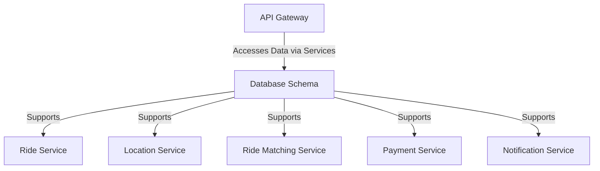

# Database Schema

The Database Schema repository defines the data structure for the ride-booking system, including schemas for user data, ride history, fares, and geospatial data storage. It serves as the foundation for data management across services.

## Key Features
- **Relational Data**: Structures for user profiles, driver details, and ride records in RDBMS like PostgreSQL.
- **Geospatial Data**: Supports location data with extensions like PostGIS for mapping.
- **NoSQL Integration**: Scalable storage for high-volume data like trip tracking in MongoDB or Cassandra.

## Architecture Diagram

## Interaction with Other Services
The Database Schema underpins data storage and retrieval for all microservices:
- **Ride Service**: Stores and retrieves ride booking data, fare calculations, and status updates.
- **Location Service**: Manages geospatial data for real-time tracking and proximity searches.
- **Ride Matching Service**: Accesses location and availability data for driver-passenger matching.
- **Payment Service**: Records transaction details, receipts, and refund information.
- **Notification Service**: Logs notification history and user preferences for targeted alerts.
- **API Gateway**: Indirectly interacts with the database through microservices, ensuring data consistency across client requests.

