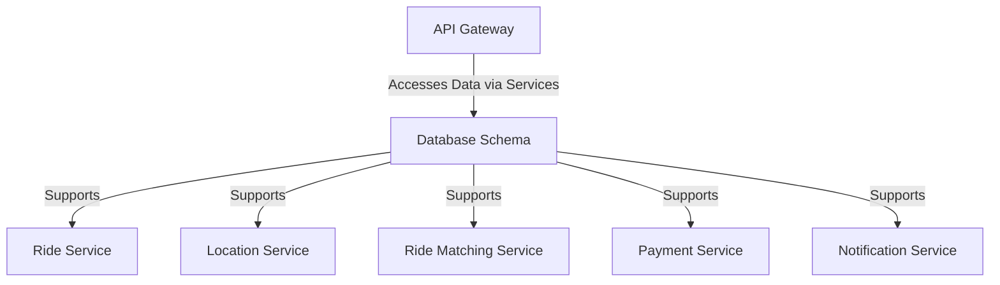

# Database Schema

The Database Schema repository defines the data structure for the ride-booking system, supporting storage for user data, ride history, fares, and geospatial data.

## Key Features
- Relational Data Storage
- Geospatial Data Support
- NoSQL Integration for Scalability

## Recommended Tech Stack
- **Relational DB**: PostgreSQL with PostGIS for geospatial data and ride records [1][4].
- **NoSQL DB**: Apache Cassandra or MongoDB for high-volume data like location tracking [1][3][4].
- **Caching**: Redis for quick access to active data [1][4].
- **Data Warehouse**: Apache Hive for analytics and querying [1].

## System Design Structure
- **Schema Definition**: Defines tables for users, drivers, rides, fares, and locations.
- **Geospatial Module**: PostGIS extension for location-based queries.
- **Scalability Layer**: Cassandra for distributed storage of trip logs.
- **Cache System**: Redis for frequent data access like driver locations.
- **Analytics Support**: Hive for processing historical ride data.

## Architecture Diagram

## Interaction with Other Services
The Database Schema supports data needs:
- **Ride Service**: Stores ride and fare data.
- **Location Service**: Manages geospatial tracking data.
- **Ride Matching Service**: Accesses driver availability.
- **Payment Service**: Records transactions.
- **Notification Service**: Logs notification history.
- **API Gateway**: Indirectly accesses data via microservices.

